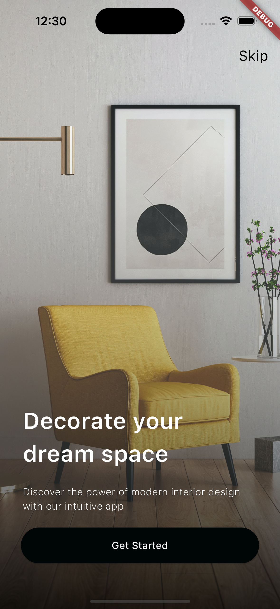
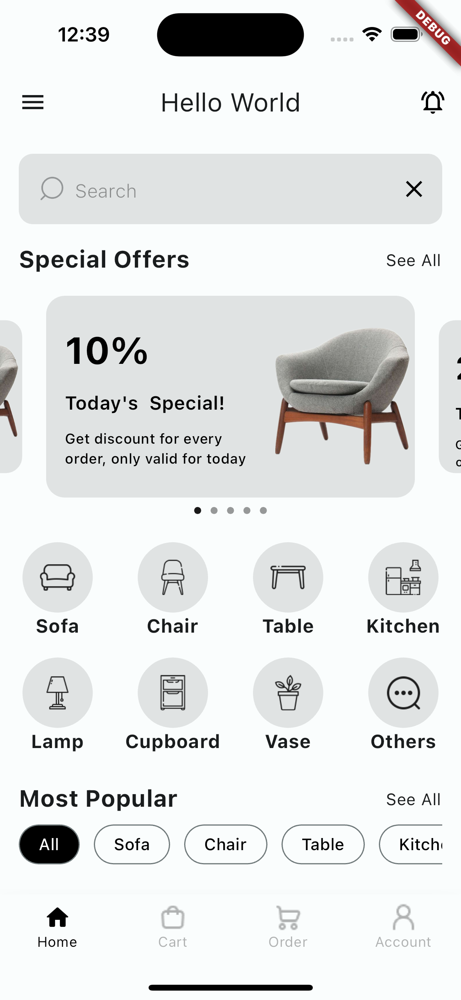
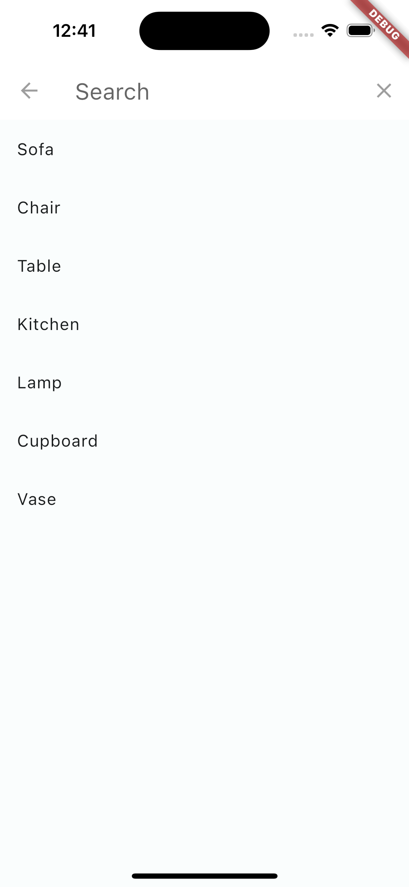
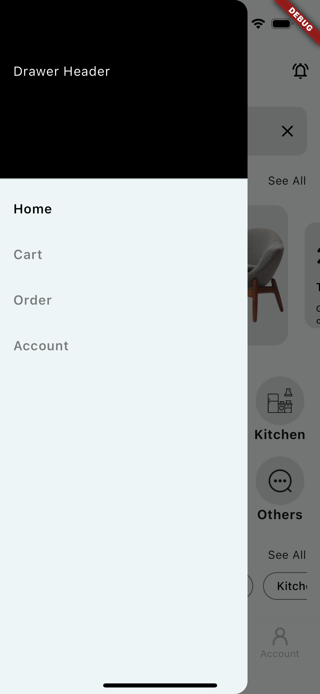

# Flutter Furniture Shop

Flutter representation of a Furniture App Concept i found on Uplabs.

Star⭐ the repo if you like what you see😉.

[Link to Original Design on Figma](https://www.figma.com/file/PC6xkXCpCpYvW8wj3xrk64/Funica---Furniture-E-Commerce-App-UI-Kit-(Preview)?type=design&node-id=1528-25132&mode=design)

# ✨ Requirements

- Any Operating System (ie. MacOS X, Linux, Windows)
- Any IDE with Flutter SDK installed (ie. IntelliJ, Android Studio, VSCode etc)
- A little knowledge of Dart and Flutter
- A brain to think 🤓🤓

# 📸 ScreenShots
| Onboarding                                                           | Home Screen                                                           | Login Screen                                                           |
|----------------------------------------------------------------------|-----------------------------------------------------------------------|------------------------------------------------------------------------|
|  |  |  |

| Otp Screen                                                           | Search Screen                                                           | Drawer Screen                                                           |                                                          
|----------------------------------------------------------------------|-------------------------------------------------------------------------|-------------------------------------------------------------------------|
|  |  |  |
